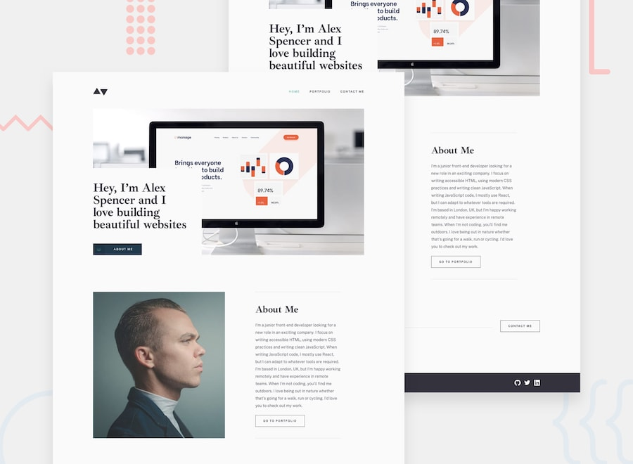

# Minimalist portfolio website - Frontend Mentor challenge

A multi-page portfolio site built with React. Includes three pages (Home, Portfolio, Contact) and single project page with details.

## Navigation

- [Overview](#overview)
  - [Screenshot](#screenshot)
  - [Main task](#main-task)
  - [Built With](#built-with)
  
- [Conclusions](#conclusions)
  - [What have I achieved](#what-have-i-achieved)
- [More about me](#more-about-me)

## Overview

### Screenshot

### Main task

The challenge is to build out this multi-page portfolio website and get it looking as close to the design as possible.

You can use any tools you like to help you complete the challenge. So if you've got something you'd like to practice, feel free to give it a go.

Also, seeing as this challenge is to build a portfolio site, please feel free to use it as your own portfolio website when you're finished!

Your users should be able to:

- Click the "About Me" call-to-action on the homepage and have the screen scroll down to the next section
- Receive an error message when the contact form is submitted if:
- The Name, Email Address or Message fields are empty should show "This field is required"
- The Email Address is not formatted correctly should show "Please use a valid email address"
- View the optimal layout for the interface depending on their device's screen size
- See hover and focus states for all interactive elements on the page

### Built With

- React
- JavaScript
- HTML5 
- CSS3 
- Flexbox
- clsx
- Formik
- Yup
- react-router-dom
- react-loader-spinner
- EmailJS

## Conclusions

The task was very interesting and comfortable for development. I have not completed a task of this complexity at Frontend Mentor, so I am satisfied with my first experience of a similar project here. This challenge helped me practice the acquired skills of building a project with React at my university and show what I have already achieved and at what level of development I am.

Speaking of design of the challenge, it was well-designed and generally easy to follow along. However, one aspect of the original design was quite frustrating and caused some layout issues. Since I wrap each section in containers, it’s easy (in most projects) to scale them and add common spacing and margins between sections. However, the design had sections at different distances from each other almost everywhere, which made styling difficult. I had to find a balance between a single margin and custom one before or after the section. If the website is small, this is not a global problem, but if we talk about larger projects, it is very inconvenient and unnecessary, since changing the indents of similar sections by 10-20 pixels does not visually change the design, but for development it is quite an inconvenient moment.

### What have I achieved

Each task was moderately easy for me and the main difficulty was precisely in the scale and correct structure of the project. The most difficult part was planning the placement of components in the file structure and their combination with each other. I also consider the understanding of componentization in the context of React to be a rather important point, which does not mean separating each section into a separate component, but analyzing and understanding their purpose.

If I were to single out the part of the work that was the most difficult for me, it would be the form. I always wanted to implement the full functionality of the form, which would correctly send data and accurately reach the recipient. So I built a form using EmailJS for the first time, which was a real treat when I first received an email after submitting the form.

Along with all of the above, after completing the basic requirements of the challenge, I wanted to try something new for myself in terms of animations. Since the project is called Minimalist, the main task for me was to add modernity to the animations without unnecessary fuss. Since I had not used React hooks for these purposes before, this was a very useful and new experience for me.

## More about me

You can find my personal website with a portfolio of my work at the link https://solvixcode.com/

- GitHub https://github.com/Olha-Fursova
- LinkedIn https://www.linkedin.com/in/olha-fursova-6727b7265/
- Frontend Mentor https://www.frontendmentor.io/profile/Olha-Fursova
- Twitch https://www.twitch.tv/solvixcode/
